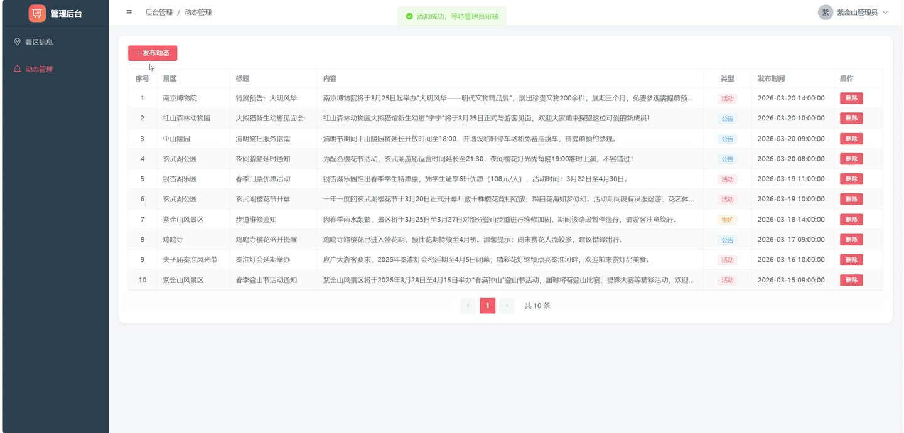
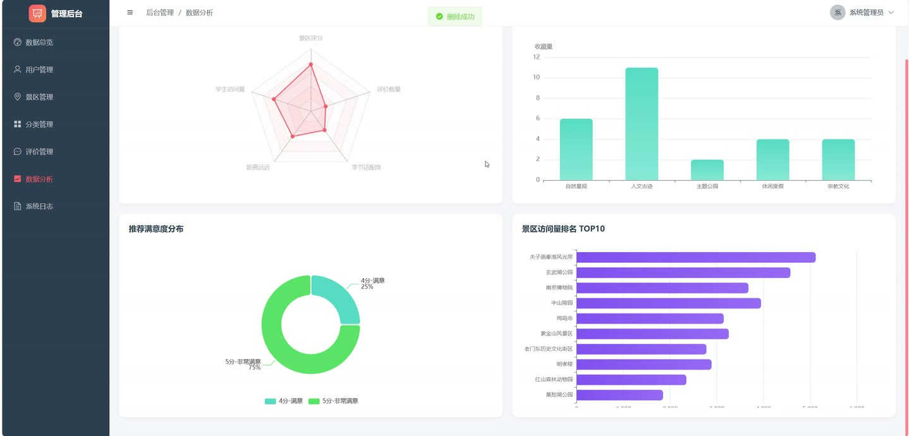

# (附文档)Springboot3+Vue3+MySQL 热度加权算法的学校周边景区推荐系统

**技术栈**：Springboot3、Vue3、MySQL

### 系统简介

本系统是一个基于 SpringBoot3 + Vue3 + MySQL 架构的学校周边景区推荐平台，采用前后端分离的微服务架构。系统内置了基于热度加权算法的个性化推荐引擎，通过多维度权重因子（景区评分、访问量、距离、季节适配度、评价数量）动态计算景区热度值，并结合用户偏好实现精准推荐。平台包含普通用户端、景区管理员端、系统管理员端三个角色，覆盖景区浏览、收藏、评价、动态发布、数据统计等全链路功能。
 
### 核心功能
 
### 普通用户端

 
- 用户注册与登录：通过用户名+密码完成注册和登录，支持自动生成 JWT Token 鉴权 
- 景区列表浏览：分页查看已审核通过的景区，支持按关键词、分类、距离上限、价格上限多条件筛选，默认按热度值降序排列 
- 景区详情查看：展示景区基本信息、分类名称、管理员名称、多张轮播图片、景区动态列表，并实时统计评价数量和平均评分 
- 个性化推荐：基于用户偏好设置（偏好分类、预算范围、距离上限、出行时间）与历史行为（浏览次数、收藏状态），结合热度加权算法生成 TOP10 推荐列表 
- 热门景区 TOP10：查看全平台热度值最高的 10 个景区，数据来源于热度加权算法的实时计算结果 
- 景区收藏/取消收藏：一键收藏感兴趣的景区，再次点击可取消收藏，收藏列表分页展示景区名称和封面 
- 浏览历史记录：自动记录每次景区详情访问，按时间倒序展示浏览历史，含景区名称和封面 
- 景区评价提交：对景区进行 1-5 分评分并填写评价内容，支持上传多张评价图片，提交后自动更新该景区的平均评分和评价总数 
- 个人中心：查看和修改个人信息（昵称、头像、手机号、邮箱、学校名称），支持修改密码（需验证旧密码） 
- 偏好设置管理：设置偏好分类（多选）、预算范围、偏好距离上限、常用出行时间，用于个性化推荐的权重调整 
- 推荐反馈提交：对推荐结果进行满意度评分（1-5 分）并填写反馈内容，帮助系统优化推荐算法 
- 我的评价列表：分页查看自己提交过的所有评价，含景区名称、评分、内容、评价图片 
- 我的反馈列表：分页查看自己提交过的推荐反馈记录，含景区名称、满意度、反馈内容
 
### 景区管理员端

 
- 我的景区管理：查看自己负责管理的所有景区列表，含景区名称、分类、状态、热度值 
- 新增景区：填写景区名称、分类、地址、距离、开放时间、门票价格、描述、封面、特色项目等信息，提交后状态默认为待审核 
- 编辑景区信息：修改已存在的景区基本信息，系统校验当前用户是否为该景区的管理员 
- 景区详情查看：查看景区完整信息，包括图片列表、动态列表、评价统计等 
- 景区图片管理：上传景区轮播图片并设置排序序号，支持删除已有图片 
- 景区动态发布：发布景区公告、促销活动、维护通知等动态，动态类型支持 NOTICE/PROMOTION/MAINTENANCE 三种 
- 景区动态管理：查看自己发布的所有动态列表，支持按景区筛选，可删除已有动态
 
### 管理员端

 
- 用户管理：分页查询所有用户列表，支持按关键词、角色、状态筛选，可启用/禁用用户、审核用户状态并填写拒绝原因，支持删除用户 
- 景区审核：分页查看所有景区列表，支持按关键词、分类、状态筛选，对待审核景区进行审核通过或拒绝操作 
- 景区管理：删除违规景区，支持一键刷新所有已审核景区的热度值（重新计算并更新数据库） 
- 分类管理：查看所有景区分类（含每个分类下的景区数量），支持新增、编辑、删除分类，分类支持排序序号 
- 评价管理：分页查看全平台所有景区评价，支持按景区筛选，可删除违规评价 
- 动态管理：分页查看所有景区发布的动态，支持按景区筛选 
- 系统日志管理：分页查看系统操作日志，支持按用户名或操作描述关键词搜索，记录操作时间、IP、请求参数 
- 推荐反馈管理：查看所有用户的推荐反馈列表，含用户昵称、景区名称、满意度、反馈内容 
- 数据仪表盘：查看总览统计数据（学生用户数、景区管理员数、景区总数、已审核数、待审核数、评价总数、总访问量） 
- 热度排名分析：以柱状图展示热度值 TOP10 景区的名称、热度分数、访问量 
- 分类分布分析：以饼图展示各分类下的景区数量分布 
- 权重因子分析：以饼图/雷达图展示五个权重因子（景区评分、学生访问量、距离远近、季节适配度、评价数量）的占比 
- 学生偏好统计：展示各分类景区的收藏量统计，以及推荐满意度的分布数据
 
### 技术栈

 后端框架Spring Boot 3.x ORM 框架MyBatis-Plus 权限认证JWT Token 鉴权 + 自定义注解 @OperLog 前端框架Vue 3 状态管理Vuex / Pinia 构建工具Vite 数据库MySQL 8.x 数据可视化ECharts 文件上传MultipartFile + UUID 生成唯一文件名
 
### 交付内容

 
- 后端完整源码 
- 前端完整源码 
- 数据库初始化脚本 
- 万字文档

## 界面展示

---

## 获取完整源码 + 万字文档

本仓库为项目介绍页。**完整前后端源码、数据库初始化脚本、万字项目文档**，请加微信 `kangkangcode`，或访问 [codekk.top](http://codekk.top) 获取。

可作课程设计 / 毕业设计参考，支持远程部署调试。